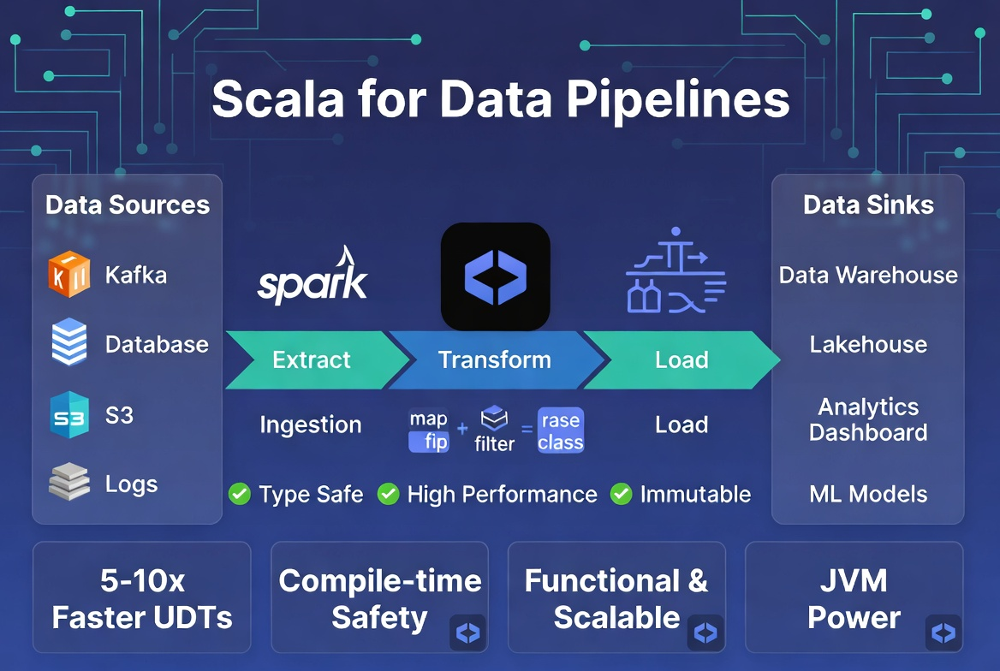

# Scala Data Pipeline: Silver Layer Transformer


A production-grade Scala Spark application designed to transform raw e-commerce transaction data (Bronze) into a cleaned, typed Parquet format (Silver).

## 🚀 Features
- **Strong Typing:** Uses Scala Case Classes to enforce schema integrity.
- **Performance:** Writes to Parquet format with optimized JVM memory management.
- **Scalability:** Designed for distributed execution on Spark clusters (Databricks, EMR).

## 📁 Data Flow
1. **Source:** `data/bronze/*.json` (Raw JSON events)
2. **Process:** 
   - Filters invalid records.
   - Calculates 15% tax.
   - Enforces uppercase ID formatting.
3. **Sink:** `data/silver/*.parquet` (Partitioned columnar storage)

## 🛠️ Requirements
- Java 8 or 11
- Scala 2.12.x
- sbt (Scala Build Tool)

## Project Hierarchy
```
data-pipeline/
├── build.sbt                   # Project dependencies and settings
├── project/                    # sbt build plugins
│   └── build.properties        # Defines sbt version
├── src/
│   ├── main/
│   │   └── scala/
│   │       └── com/
│   │           └── pipeline/
│   │               ├── models/
│   │               │   └── Transaction.scala   # Case classes
│   │               └── SilverTransformer.scala # Main ETL Logic
│   └── test/
│       └── scala/              # Unit tests go here
├── data/
│   ├── bronze/                 # Raw input files (JSON)
│   └── silver/                 # Processed output (Parquet)
└── README.md                   # Documentation
```

## 🏃 How to Run
1. **Place your raw data:** 
   Ensure your JSON files are in `data/bronze/`.
2. **Compile the project:**
   ```bash
   sbt compile
